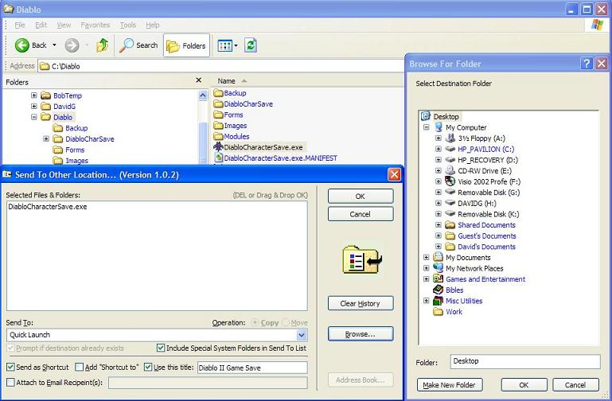



## Send To Location 1\.0\.3 \(update 3\)

### Description

Updated to demonstrate binary-embedded XP Manifest invocation. The SendToLocation utility is a emensely useful program that operates from, and inserts a shortcut to itself in your Windows Explorer SendTo folder. When you are copying or moving folders, you can simply select them within Windows Explorer, right-click, select Send To, and then choose the "Send To Location..." option. This utility emulates a wonderful utility that had been included in the now-defunct Miscrosoft Windows 95 Power Toys package (I think it had also been included in the Windows 98 Power Toys). When the SendToLocation program comes up, you are presented with a list of the files/folders you have selected to process. You are given an option to copy or move them. You can also browse to the target location, or choose from a combobox of previously selected destination locations (most recent to the top, and you can clear this history at any time with the Clear History button). You also have the option to send created shortcuts for the selected items at the destination location, such as the Desktop, a Desktop folder, or whatever you choose. If you are creating a shortcut for only a single file, you can change the default name of the shortcut to something more meaningful to you, such as replacing a default like "PrjMyCalc.exe" to "My Personal Calculator". Another option is to send the selected item or items as attachments in MAPI-based email (you can choose recipients from within the application, or from within your email program), and when you hit OK, it will open up you MAPI-based email application. I have used this utility in all its evolutionary forms on a daily basis since 1998. I thought it was about time I shared it with others. *** Version 1.0.1 added a check to ensure that someone is not trying to email a folder, which is seldome a recommended practice, and email programs do not like it. It will now recommend that you compress the folder to a ZIP file. *** Version 1.0.2 Added the ability to Drag and drop forgotten files onto the list, and the ability to select entries and delete them, if a file/folder was accidently added to the list. Added full-path tooltips when the mouse moves over a file/folder entry. Added option to include special system folders in Send To list, such as the Send To folder, the Desktop, the Startup menu, My Documents, and others. *** Version 1.0.3 demonstrates using an imbedded XP-Style Manifest from a Resource file (*.res). If you are upgrading from a previous version, please remove the SendToLocation.exe.Manifest file if it is present.
 
### More Info
 

             |
---                |---
**Submitted On**   |2007-05-11 00:09:46
**By**             |[David Ross Goben](https://github.com/Planet-Source-Code/PSCIndex/blob/master/ByAuthor/david-ross-goben.md)
**Level**          |Advanced
**User Rating**    |5.0 (30 globes from 6 users)
**Compatibility**  |VB 6\.0
**Category**       |[Complete Applications](https://github.com/Planet-Source-Code/PSCIndex/blob/master/ByCategory/complete-applications__1-27.md)
**World**          |[Visual Basic](https://github.com/Planet-Source-Code/PSCIndex/blob/master/ByWorld/visual-basic.md)
**Archive File**   |[Send\_To\_Lo2065075112007\.zip](https://github.com/Planet-Source-Code/david-ross-goben-send-to-location-1-0-3-update-3__1-68510/archive/master.zip)

